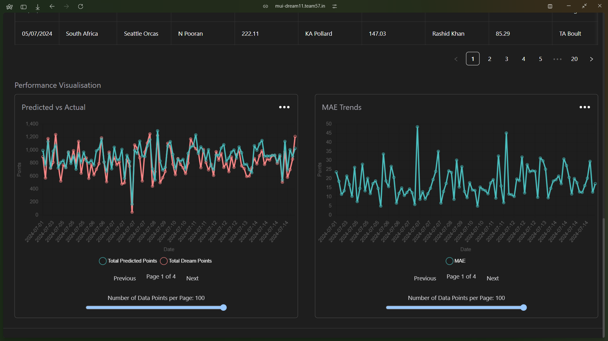

# **Innovative Solution for Inter IIT Tech Meet 13.0**

This project was developed as a solution to a complex and competitive problem statement presented at **Inter IIT Tech Meet 13.0**. The challenge involved creating a comprehensive system to **predict cricket player performances** and recommend **winning fantasy cricket teams** for Dream11. This solution had to consider a multitude of factors, including historical player data, match contexts, and team strategies, all while delivering reliable, real-time outputs.

Deployed at [Edge11](https://dream-eleven-gold.vercel.app/)

Presentation at [Link](public/team_57_dream11.pdf)

## **Problem Statement**

The problem required:
1. **Player Performance Prediction**: Develop a system to accurately predict cricket players' performances for upcoming matches based on historical data and contextual variables like venue, pitch, and weather conditions.
2. **Fantasy Team Optimization**: Recommend the best possible team composition adhering to Dream11 constraints.
3. **Data Challenges**: Handle edge cases such as retired players, future matches with unknown variables, and missing or incomplete data.

We tackled this problem using a **full-stack solution** powered by **state-of-the-art machine learning** and robust web technologies.

---

## 🌟 Project Overview  
This application integrates cutting-edge technologies across **frontend**, **backend**, and **machine learning** domains to deliver a seamless, feature-rich experience for cricket enthusiasts. It consists of:

1. **Frontend**: Built with **Next.js** and **Tailwind CSS** for a dynamic, responsive, and visually appealing user interface.
2. **Backend**: Powered by a robust **Node.js** API layer to manage data processing and communication.
3. **Machine Learning**: Employs an **XGBoost model** to predict player performance based on extensive cricket datasets.

---

## 🖥️ Tech Stack  

| Technology       | Description                           | Logo          |
|-------------------|---------------------------------------|---------------|
| **Next.js**       | Frontend framework for React.         |  |
| **Tailwind CSS**  | Utility-first CSS framework.          |  |
| **TypeScript**    | Typed superset of JavaScript.         |  |
| **Node.js**       | Backend runtime environment.          |  |
| **XGBoost**       | Gradient boosting machine learning.   |  |
| **OpenAI API**    | Chatbot for answering team queries.   |  |

---

## 🎨 Frontend  
The frontend was developed using **Next.js** for its server-side rendering capabilities and enhanced performance. **Tailwind CSS** was utilized to achieve a clean, responsive, and user-friendly design. The interface provides:  
- Interactive inputs for match details and player preferences.  
- Visualizations of predicted scores and optimal team configurations.  
- Chatbot integration for user queries.  

---

## 🔧 Backend  
The backend is implemented with **Node.js**, handling data preprocessing and interactions between the user interface and machine learning models. APIs are optimized for low-latency responses, ensuring smooth user experiences during real-time interactions.

---

## 🤖 Machine Learning  
Our **XGBoost**-based model was meticulously crafted to predict player performances. Key highlights include:  
- **Dataset**: Trained on **CricSheet ball-by-ball data** spanning 2001–2024.  
- **Feature Engineering**: Incorporated metrics like venue, pitch, weather, and player momentum.  
- **Experiments**: Tested advanced models like **Neural Networks**, **LightGBM**, **CatBoost**, and **N-BEATS**, but XGBoost consistently outperformed others.  
- **Challenges**:  
  - Handling **retired players** and ensuring accurate predictions for their historical performance.  
  - Managing **future dates** effectively to avoid data leakage.  

[**View the Machine Learning Model**](https://www.kaggle.com/code/adityakumar2003/dream11-final-model)

---

## 🧠 Chatbot  
To enhance usability, a **chatbot powered by OpenAI API** was integrated, allowing users to query the rationale behind player selections. For example:  
> *"Why was MS Dhoni chosen for this match?"*  
The chatbot explains player selection based on recent form, historical performance, and contextual match factors.

---

## **Key Features**

### **Frontend**
- **User-Centric Design**: Built for ease of use and accessibility.
- **Dynamic Fantasy Recommendations**: Displays optimized fantasy teams based on real-time model predictions.
- **Seamless Navigation**: Intuitive routing and navigation built with Next.js' powerful app router.

### **Backend**
- **Data-Driven APIs**: APIs handle player performance data, team constraints, and real-time predictions.
- **Scalability**: Designed to handle large traffic with high concurrency.

### **Machine Learning**
- **Player Performance Predictions**: The XGBoost model predicts fantasy points for players with high accuracy.
- **Fantasy Team Optimization**: Recommends team combinations within Dream11's constraints.
- **Continuous Improvements**: The model can be updated with fresh data to improve accuracy over time.

---

## **Challenges Faced**
- **Handling Retired Players**:  
  Incorporating logic to identify retired players and exclude them from fantasy team recommendations while maintaining historical data integrity.  
- **Future Match Predictions**:  
  Developing fallback strategies for missing or speculative inputs like pitch conditions, weather forecasts, or team line-ups.  
- **Data Cleaning and Feature Engineering**:  
  Processing and merging large datasets required significant computational resources and careful feature selection.

---

Here’s the updated **Demos** section with larger images displayed one below the other:

---

## 📸 Demos  

**Screenshots of the Application**  

**Screenshot 1**  
  

**Screenshot 2**  
  

**Screenshot 3**  
 

**Screenshot 4**  
 

**Demo Video**  
[Watch the Full Demo](public/demo.mp4)  

---

## **How to run in localhost?**

### Development Environment Setup
1. Clone the repository:
   ```bash
   git clone https://github.com/your-repo/project.git
   cd project
   ```
2. Install dependencies:
   ```bash
   npm install
   ```

3. Start the development server:
   ```bash
   npm run dev
   ```
   Access the app at [localhost](http://localhost:3000).

### Backend Setup
- Start the backend server:
  Refer to [Edge11 Backend](https://github.com/hadityakumar/Edge11backend)

---

## 🔗 Connect with Me  
[LinkedIn](https://linkedin.com/in/hadityakumar)

---

With this project, we have demonstrated the fusion of cricket analytics, machine learning, and modern web technologies to solve a real-world problem innovatively. 